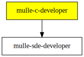

# mulle-c-developer

#### 🧢 mulle-c developer kit for mulle-sde

This developer kit adds unto
[mulle-sde-developer](//github.com/mulle-sde/mulle-sde-developer)
by adding more elaborate cmake templates. It is the basis for more
generally useful developer kits like
[mulle-objc-developer](//github.com/mulle-objc/mulle-objc-developer) or
[foundation-developer](//github.com/MulleFoundation/foundation-developer)

These templates enable you to:

* create standalone dynamic libraries, used by mulle-test
* startup libraries, used by mulle-objc
* use whole-archive linking, used by mulle-objc
* tweak some compiler settings, like add -DNDEBUG for Release


## Usage

Check that the (meta) extensions are found with `mulle-sde extension show`

### Create an executable mulle-c project

``` sh
mulle-sde init -d hello-exe -m mulle-c/c-developer executable
```

### Create a library mulle-c project

``` sh 
mulle-sde init -d hello-lib -m mulle-c/c-developer library
```


### You are here




## Author

[Nat!](https://mulle-kybernetik.com/weblog) for Mulle kybernetiK  


